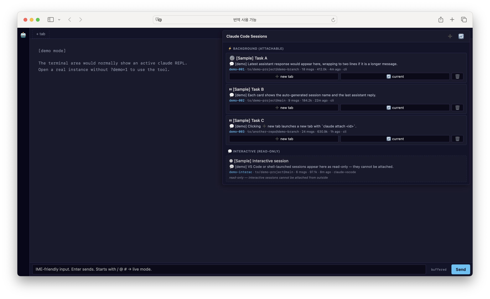

# claude-web-terminal

> A web UI for Claude Code's [Agent View](https://docs.claude.com/en/docs/claude-code/overview) — the same `claude agents` functionality you'd run in a terminal (list, create, attach, stop background sessions) but rendered as cards in your browser, with richer metadata (last assistant reply, token totals, branch, message count) than the CLI TUI shows.

 



> Screenshot above uses the built-in `?demo=1` flag — all sessions and content are synthetic.

---

## Security model

This server spawns a real shell + `claude` REPL on your machine and exposes
it over HTTP/WebSocket, so it ships with two layers of access control,
**both required**:

- **Loopback bind** — `127.0.0.1` only; not reachable from the network.
- **Random per-start auth token** — set as an httpOnly `SameSite=Strict`
  cookie via a `?t=<token>` bootstrap URL. The `Origin` header is also
  validated on every API call and WebSocket upgrade, so a malicious page
  in your browser cannot cross-connect to the local server (CSWSH/CSRF
  protection).

Do not change `HOST` to `0.0.0.0` on a shared network — even with the
token, the API surface (cwds, session names, last assistant text) is not
designed for multi-tenant exposure.

## Why

Claude Code v2 introduced background sessions (`claude --bg "<task>"`) and the
`claude agents` TUI to manage them. If you're juggling several long-running
agents at once — research, refactors, audits — the TUI is fine but doesn't
give you a quick visual overview, and you can't easily click between them.

**This project takes the same Agent View concept and renders it as a web UI**:
the cards expose more metadata than the CLI TUI, navigation is mouse-driven,
and you can attach a session into a new browser tab with one click. Under the
hood it just spawns `claude attach <id>` / `claude --bg "<prompt>"` / `claude
stop <id>` — the same commands you'd run yourself.

`claude-web-terminal` is a small Node/Express server that exposes a web UI
with:

- A real Claude Code terminal in your browser (via [xterm.js](https://xtermjs.org/) + [node-pty](https://github.com/microsoft/node-pty)) — multiple tabs with WebSocket auto-reconnect.
- A side panel that lists every active background session, every live interactive session, and every resumable past session — with names, last assistant response, token usage, branch, and message count.
- One-click **attach** (new or current tab) and **resume** for past sessions (auto-resolves the original cwd).
- ➕ **create**, ✏️ **rename**, 🗑 **stop**, ⭐ **pin** sessions.
- 🔎 search + ⏱ time filter (2d / 5d / 7d / 2w / 1m) for quickly finding a session.
- 🔔 desktop notifications when a background session goes from working → idle.
- Model toggle (Opus / Sonnet / Haiku) and keyboard shortcuts (`Cmd+T/W/K/1-9`).
- An optional IME-friendly input bar that fixes Safari's broken Korean/Chinese/Japanese composition inside xterm.js.

## Quick start

```bash
git clone https://github.com/oh-namgyu/claude-web-terminal.git
cd claude-web-terminal
npm install
cp .env.example .env       # adjust HOST/PORT if you like
npm start
```

On first start the console prints a bootstrap URL with a one-time token:

```
claude-web-terminal
  Open this URL once to authenticate (token is set as a cookie):
  →  http://127.0.0.1:8765/?t=<random-token>
```

Open that URL once — the server sets an httpOnly `SameSite=Strict` cookie,
strips the token from the URL, and subsequent visits to
`http://127.0.0.1:8765` work without the token. The first tab auto-runs
`claude` for you.

By default a new random token is generated on every restart. Set
`AUTH_TOKEN=<your-value>` in `.env` if you want the bootstrap URL to stay
the same across restarts.

## Keyboard shortcuts

The modifier is **⌘ Command** on macOS and **Ctrl** on Windows / Linux.
Shortcuts are suppressed while an IME composition is active so they don't
fight Korean / Chinese / Japanese input.

| Action                                    | macOS         | Windows / Linux |
| ----------------------------------------- | ------------- | --------------- |
| New tab                                   | `⌘ T`         | `Ctrl + T`      |
| Close active tab                          | `⌘ W`         | `Ctrl + W`      |
| Open Agent panel + focus search           | `⌘ K`         | `Ctrl + K`      |
| Switch to nth tab (1–9)                   | `⌘ 1` … `⌘ 9` | `Ctrl + 1` … `Ctrl + 9` |

> Most browsers also bind `Ctrl/⌘ + T` and `Ctrl/⌘ + W` for browser tabs.
> The page handler calls `preventDefault()` so the browser-level binding
> won't fire while the app is focused.

## CLI helper: `cc-resume`

`claude --resume <id>` only finds sessions whose original cwd matches
your current shell. If you can't remember where a session was created,
use the bundled helper — it locates the transcript, reads the original
cwd, and `cd`s there before resuming:

```bash
ln -s "$PWD/bin/cc-resume" /usr/local/bin/cc-resume   # or add bin/ to PATH

cc-resume <sessionId>     # full id
cc-resume 71fc583c        # prefix is enough if unambiguous
```

## Requirements

- Node.js 18+
- [Claude Code CLI](https://docs.claude.com/en/docs/claude-code/overview) on `PATH`, authenticated (Pro/Max login or `ANTHROPIC_API_KEY`).

## How it works

| What | Where it comes from | Status |
|---|---|---|
| Background session ID list | `/tmp/cc-daemon-<UID>/<daemon>/rv/<jobId>.sock` (existence = alive) | undocumented internal of Claude Code |
| Session metadata (name, status, kind, cwd, sessionId) | `~/.claude/sessions/<pid>.json` | undocumented internal |
| Transcript (last response, token usage, branch, msg count) | `~/.claude/projects/<cwd-slug>/<sessionUUID>.jsonl` | undocumented internal |
| `attach` / `stop` / `--bg` | Public `claude` CLI subcommands | stable |

The session listing relies on three undocumented paths. If a future Claude
Code release changes them, edit [`lib/cc-sessions.js`](lib/cc-sessions.js).

## Agent View panel

Click the 🤖 button on the left sidebar. The panel shows two sections:

- **⚡ Background (attachable)** — created via `claude --bg "<prompt>"` or via the ➕ button. You can attach in a new tab, replace the current tab, or stop the session.
- **💬 Interactive (read-only)** — any live `claude` REPL on the system (this app's own tabs, your VS Code claude, a raw shell tab). They are listed for visibility but can't be attached because they're not registered with the background daemon.

Each card shows the auto-generated name, the last assistant message snippet,
working directory + git branch, message count, total token usage, and time
since last update.

## IME-friendly input bar

xterm.js's hidden helper textarea is 1×1px, which Safari/WebKit can refuse
to activate for IME composition (Korean, Japanese, Chinese). When that
happens you see decomposed jamo / kana / pinyin instead of composed
characters.

The bar below the terminal is a normal-sized textarea that Safari composes
properly. It has two modes:

- **buffered** — type your message, press Enter, the whole composed string is
  sent to the active tab.
- **passthrough** — if your input starts with `/`, `@`, or `#`, every
  keystroke is forwarded live so Claude Code's slash-command popup, file
  mention picker, and memory shortcut all work in real time. Arrow keys,
  Escape, and Backspace are translated to the right control sequences.

## Preview without Claude Code installed

Open `http://127.0.0.1:8765/?demo=1&showAgents=1` to view the Agent View panel
with synthetic sample sessions. No real session data is used, no `claude` binary
is required for this preview. Helpful for screenshots and demos.

## Configuration

All via environment variables — see [`.env.example`](.env.example):

| Variable | Default | Purpose |
|---|---|---|
| `HOST` | `127.0.0.1` | Bind host. **Don't change to `0.0.0.0` on a shared network** — `/api/cc-sessions` exposes the cwd, name and last assistant text of every session. |
| `PORT` | `8765` | Web UI port |
| `CLAUDE_BIN` | *(PATH lookup)* | Path to the `claude` binary |
| `DEFAULT_CWD` | `$HOME` | Working directory for new tabs |
| `AUTH_TOKEN` | *(random per start)* | Fixed loopback auth token. If unset, a random 192-bit token is generated each start and printed to the console as `?t=<token>`. Open that URL once to set the auth cookie. |

## What this is not

- Not a replacement for the Claude Code CLI — it spawns it.
- Not a cloud service. Everything runs on your machine.
- Not a multi-user system. The session paths assume a single UID.

## License

MIT — see [LICENSE](LICENSE).
